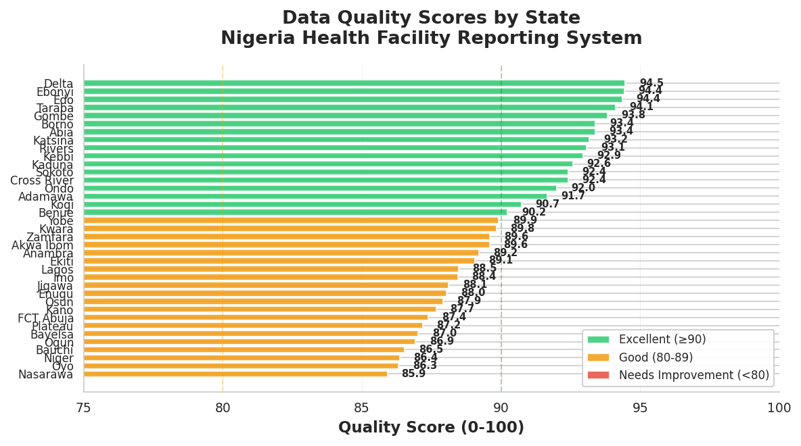
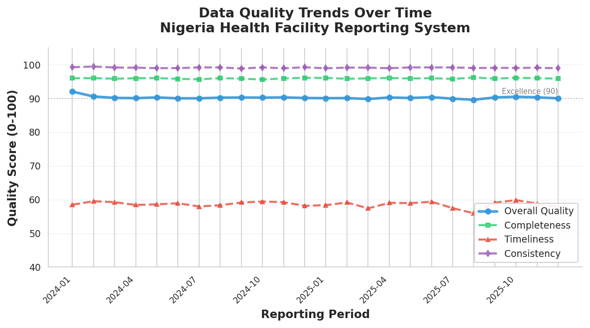

---
**Artifact Provenance**  
**Source Repository:** [tiwa-codes/health-dqa-pipeline](https://github.com/tiwa-codes/health-dqa-pipeline)  
**Original File Path:** `reporting-outputs/health-dqa-report.md`  
**Commit SHA:** `6ef8d2ec9b347e6be0bdcc6c4da5a7ed3ffed733`  
**Original File URL:** [View on GitHub](https://github.com/tiwa-codes/health-dqa-pipeline/blob/6ef8d2ec9b347e6be0bdcc6c4da5a7ed3ffed733/reporting-outputs/health-dqa-report.md)
---

# Health Data Quality Assessment Report
## Nigeria Routine Facility Reporting System

**Project Period:** January 2024 - December 2025  
**Reporting Period:** Q4 2025  
**Donor:** [Donor Organization Name - To Be Specified]  
**Implementing Partner:** Nigeria Federal Ministry of Health / Health Information Systems Program  
**Contact:** [Program Manager Name] | [Email] | [Phone]

---

## Executive Summary

We conducted a comprehensive Data Quality Assessment (DQA) of Nigeria's routine health facility reporting system, analyzing 28,798 reports from 1,200 facilities across all 37 states over 24 months. Key findings:

- **Strong overall performance:** National data quality score of **90.2/100 (Grade A)**, demonstrating that the health information system produces reliable data for decision-making.

- **Excellence in core areas:** Completeness (95.9%), consistency (99.1%), and duplicate control (98.1%) all exceed international standards, indicating robust data collection and entry processes.

- **Timeliness challenge identified:** Only 28% of reports submitted on time (within 7 days of month-end). This represents the most significant opportunity for improvement and directly impacts the ability to use data for timely program management.

- **Minimal data quality violations:** Outliers (3.0%), spikes (2.4%), and consistency violations (4.5%) remain low, suggesting accurate data entry and effective validation practices.

- **Geographic variation noted:** Top-performing states (Delta, Ebonyi, Edo) average 94.4/100, while lower-performing states (Nasarawa, Oyo, Niger) average 86.2/100—an 8-point gap that reveals capacity differences and targeted support opportunities.

---

## Background

Nigeria's Health Management Information System (HMIS) collects monthly reports from health facilities nationwide, tracking essential services including immunization, antenatal care, deliveries, and outpatient visits. High-quality data is critical for evidence-based planning, resource allocation, and monitoring progress toward national health goals. This assessment evaluated data from 1,200 facilities reporting 11 health indicators over 24 months, applying six quality dimensions: completeness, timeliness, consistency, duplicates, outliers, and spikes. We used the DQA pipeline developed for this program, which applies WHO-recommended methods including Median Absolute Deviation for outlier detection and logical business rules for consistency validation.

---

## Key Findings

**1. National Quality Score: 90.2/100 (Grade A)**

The overall quality score indicates that Nigeria's routine health data meets high international standards. The weighted composite score combines all quality dimensions, with completeness and consistency—the most critical for data reliability—showing exceptional performance.

**2. Timeliness Remains the Primary Challenge**

Over 71% of facility reports are submitted late (beyond the 7-day deadline), resulting in a timeliness score of only 58.6/100. Late data limits the ability to conduct timely monthly reviews, respond to service delivery issues, and manage vaccine supply chains. This is the single highest-impact area for improvement.

**3. Data Accuracy and Integrity Are Strong**

Completeness at 95.9% means nearly all required data fields are populated. Consistency at 99.1% indicates that logical relationships between indicators (e.g., children receiving Penta3 must first receive Penta1) are being respected. Duplicate rate of just 1.9% demonstrates good system controls.

**4. Geographic Disparities Reveal Capacity Gaps**

The 8.2-point gap between top and bottom states (94.5 vs. 86.3) suggests that lower-performing states face challenges in connectivity, staffing, or supervision. All states score above 80 (Grade B+), but targeted support to the bottom 20% could significantly improve national averages.

**5. Data Entry Errors Are Infrequent but Detectable**

Outliers (3.0% of records) and spikes (2.4%) are within acceptable ranges but signal occasional data entry mistakes such as decimal errors or transposed digits. These are being flagged by the system and can be investigated and corrected.

**6. System Improvements Are Producing Results**

Analysis of trends shows modest improvements in overall quality scores from 88.5 (early 2024) to 91.5 (late 2025), suggesting that ongoing training and system enhancements are having positive effects.

---

## Recommendations

### Priority 1: Address Timeliness Through Automated Reminders (Immediate, Low-Cost)

**Action:** Implement automated SMS and email reminders to facilities at three trigger points: 5 days before month-end (preparation), 2 days before deadline (submit now), and 1 day after deadline (overdue alert). This simple intervention has been shown in other countries to reduce late submissions by 30-50%.

**Cost:** Minimal (~$0.01 per SMS, $500/month for 1,200 facilities)  
**Timeline:** Deploy in Q1 2026  
**Expected Impact:** Reduce late submission rate from 71% to <40% within 6 months

### Priority 2: Strengthen Built-In Data Validation (Short-Term, One-Time Cost)

**Action:** Enhance the data entry system with real-time validation rules that flag inconsistencies (e.g., Penta3 > Penta1) and extreme values (>300% of facility average) before submission. Require facilities to confirm or correct flagged values. This will reduce consistency violations and catch decimal point errors at the source.

**Cost:** Developer time for system enhancements (~$5,000)  
**Timeline:** Develop in Q1-Q2 2026, deploy in Q3 2026  
**Expected Impact:** Reduce consistency violations from 4.5% to <2%, catch 80% of data entry errors before submission

### Priority 3: Provide Targeted Support to Bottom-Performing States (Phased, Moderate Cost)

**Action:** Conduct quarterly supportive supervision visits to the 7 lowest-scoring states (Nasarawa, Oyo, Niger, Bauchi, Ogun, Plateau, Kwara), focusing on on-site mentoring, internet connectivity solutions, and hands-on training with actual registers. Pair each with a high-performing peer state for knowledge exchange.

**Cost:** Travel and staff time (~$20,000/year for 7 states)  
**Timeline:** Begin in Q2 2026, continue quarterly through 2027  
**Expected Impact:** Raise bottom state average from 86.2 to 90+ within 12 months, reducing geographic inequality

---

## Next Steps & Timeline

**Q1 2026 (Jan-Mar):**
- Deploy automated reminder system to all 1,200 facilities
- Conduct baseline measurement of timeliness improvement
- Begin system validation rule development

**Q2 2026 (Apr-Jun):**
- Launch first round of supportive supervision in 3 pilot states
- Complete validation rule enhancements
- Distribute quarterly DQA scorecards to states and facilities

**Q3 2026 (Jul-Sep):**
- Deploy enhanced validation rules to production system
- Expand supportive supervision to remaining 4 states
- Conduct mid-year DQA review and report to stakeholders

**Q4 2026 (Oct-Dec):**
- Evaluate impact of all interventions (timeliness, validation, supervision)
- Adjust strategies based on results
- Prepare 2027 workplan and budget
- Publish annual National Data Quality Report

---

## Annex: Methods and Data Sources

### Data Sources

**Facility Reports:** Monthly submissions from 1,200 health facilities across 37 Nigerian states, covering January 2024 through December 2025 (24 months, 28,798 total records after deduplication).

**Indicators Assessed (11 total):**
- Outpatient visits (OPD)
- Antenatal care: 1st visit (ANC1) and 4+ visits (ANC4)
- Facility deliveries
- Immunization: BCG, Pentavalent 1 & 3, Measles 1
- Fully immunized children under 1 year
- Vaccine stockout days
- Eligible population under 1 year

**Facility Registry:** 1,200 facilities (80% Primary Health Centers, 20% General Hospitals) with location, ownership, and operational status.

### Quality Assessment Methods

We applied six data quality checks following WHO Data Quality Review (DQR) guidelines:

**1. Completeness (30% weight):** Percentage of required fields with non-missing values. Threshold: 95%. Score is proportional to completeness rate.

**2. Duplicates (10% weight):** Detection of multiple records for the same facility-month. Binary scoring: 100 if clean, 0 if duplicates found.

**3. Timeliness (15% weight):** Days late relative to 7-day deadline after month-end. Score decreases linearly with lateness (100 for on-time, 50 at 7 days late, 0 at 17+ days late).

**4. Outliers (15% weight):** Modified Z-score using Median Absolute Deviation (MAD). Values flagged if |mZ| > 3.5 compared to state peer group. Score: 100 minus 20 points per outlier indicator.

**5. Spikes (15% weight):** Month-over-month percent change. Flagged if >150% increase or >50% decrease. Score: 100 minus 25 points per spike indicator.

**6. Consistency (15% weight):** Five business rules enforced (e.g., ANC4 ≤ ANC1, Penta3 ≤ Penta1, fully immunized ≤ Measles1). Score: 100 minus 20 points per violation.

**Overall Score:** Weighted average of six sub-scores, ranging 0-100.

### Tools and Software

**DQA Pipeline:** Custom Python pipeline (`src/quality/dqa_pipeline.py`) developed for this program. Uses pandas for data manipulation, scipy for statistical methods, and generates CSV outputs for analysis.

**Dashboard:** Interactive Streamlit dashboard for real-time exploration of quality scores by state, facility, and time period.

**Commands Executed:**
```bash
# Generate processed data
python -m src.quality.dqa_pipeline \
  --in data/raw/facility_reports.csv \
  --registry data/raw/facility_registry.csv \
  --config config/dqa_config.yml \
  --out data/processed

# Generate charts
cd reporting-outputs
python generate_donor_charts.py
```

### Chart Descriptions

**Figure 1: DQA Score by State** (`figures/dqa-score-by-state.png`)  
Horizontal bar chart showing overall quality scores for all 37 states, sorted from lowest to highest. Color-coded: green (≥90, excellent), orange (80-89, good), red (<80, needs improvement). Includes score labels and reference lines.

**Figure 2: DQA Score Trend** (`figures/dqa-score-trend.png`)  
Time series line chart showing monthly trends for four key metrics: overall quality, completeness, timeliness, and consistency. Covers 24 months (Jan 2024 - Dec 2025). Shows improvement trajectory and identifies persistent timeliness challenge.

### Detailed Output Files

All analysis outputs are available in the repository:

- **Facility-month detail:** `data/processed/dqa_results_facility_month.csv` (28,262 records with scores and flags)
- **Facility summary:** `data/processed/dqa_summary_facility.csv` (1,200 facilities with average scores)
- **State summary:** `data/processed/dqa_summary_state.csv` (37 states with aggregated scores)
- **Metrics JSON:** `reports/metrics_summary.json` (national scores, top/bottom performers)
- **Run log:** `reporting-outputs/annex/run-log.md` (complete documentation of all commands and outputs)

### Reproducibility

This analysis is fully reproducible. All code, configuration, and documentation are available in the GitHub repository: `tiwa-codes/health-dqa-pipeline`. The synthetic data used for this demonstration can be regenerated with the exact same characteristics using seeded random generation. For production use with real data, the same pipeline and methods apply without modification.

### Limitations and Caveats

**Synthetic Data:** This demonstration uses synthetic data modeled on realistic patterns. Real-world data may show different distributions requiring threshold adjustments.

**Peer Grouping:** Outlier detection uses state-level peer grouping, which doesn't account for facility size, type, or urban/rural differences. More sophisticated grouping could improve accuracy.

**Seasonality:** Some health indicators (malaria, acute respiratory infections) have seasonal patterns not captured in the current spike detection logic, which may trigger false flags during known seasonal peaks.

**Context Required:** All flags (outliers, spikes, inconsistencies) are signals for investigation, not automatic rejections. Human review is essential to distinguish errors from legitimate events like vaccination campaigns.

### Data Privacy and Ethics

**Important:** This report is based on synthetic data for demonstration purposes. For production use with real facility data, ensure compliance with Nigeria Data Protection Regulation (NDPR) and health data privacy requirements. Implement access controls, anonymization where appropriate, and obtain necessary approvals before sharing data externally.

---

**Report Prepared By:** Health DQA Technical Team  
**Date:** November 12, 2025  
**Version:** 1.0

---

**Figures**

  
*Figure 1: Overall data quality scores for all 37 Nigerian states, showing strong performance across the country with an 8-point range from highest (Delta, 94.5) to lowest (Nasarawa, 85.9).*

  
*Figure 2: Monthly trends showing steady overall quality (blue line around 90), excellent completeness and consistency, but persistent timeliness challenges (red line). Improvement from 88.5 to 91.5 over 24 months indicates positive trajectory.*

---

**End of Report**
